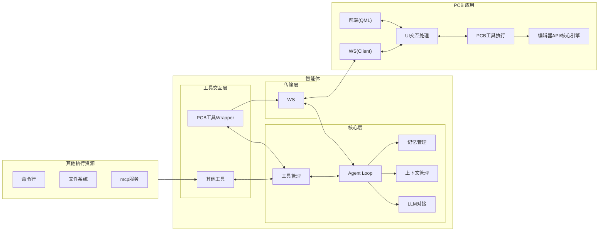
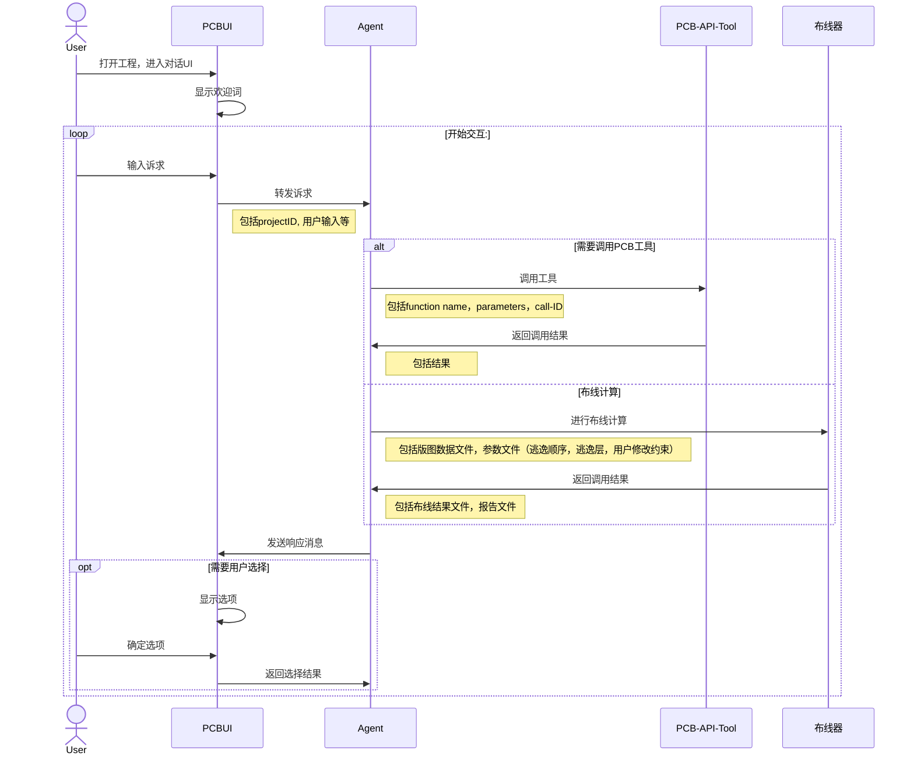
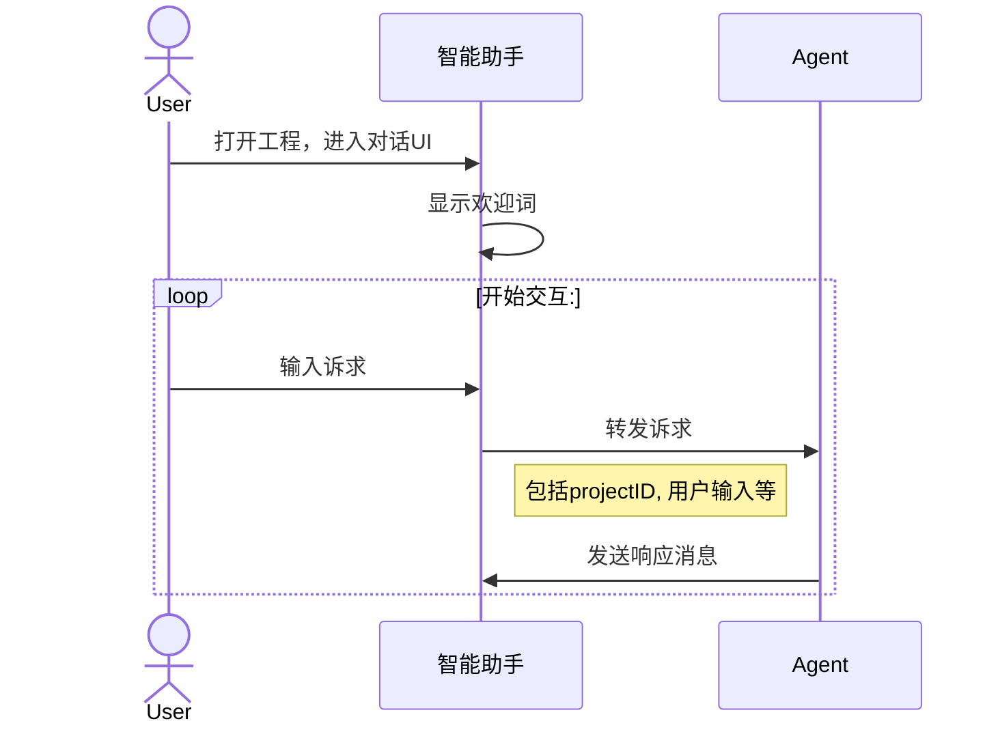
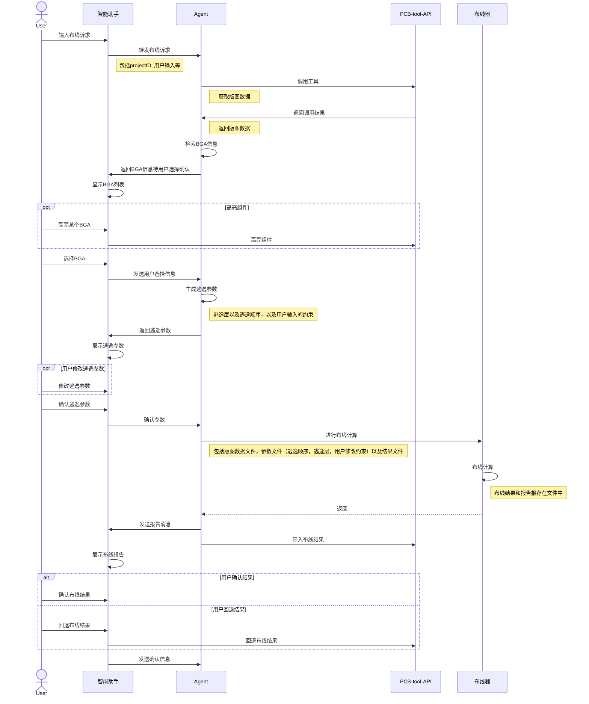
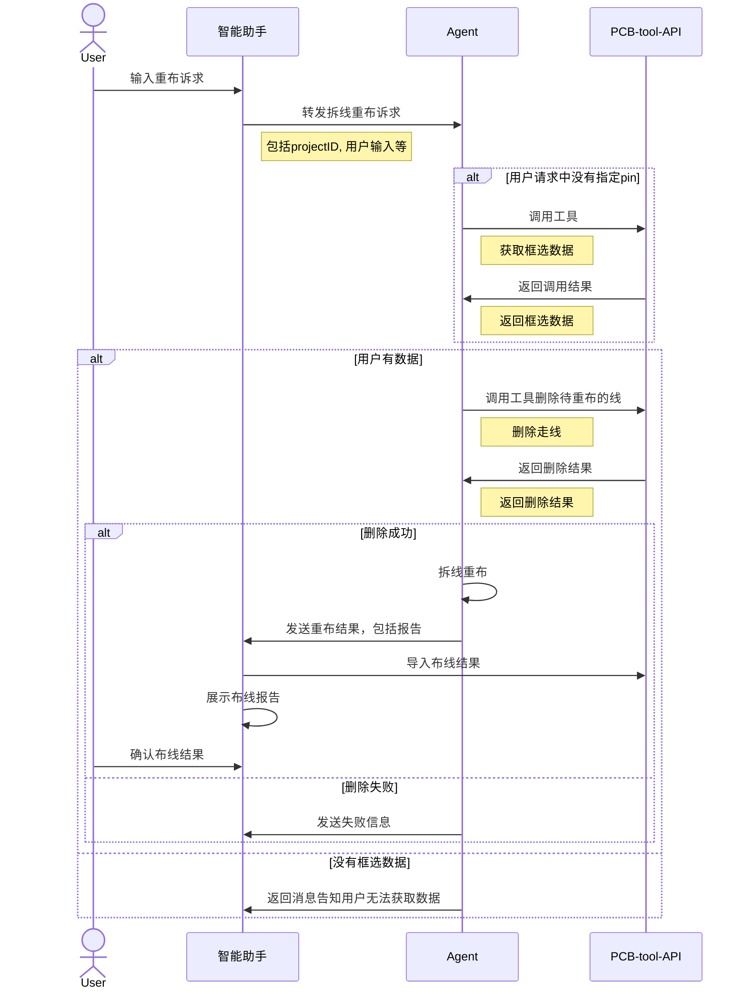

# AI加持的逃逸布线需求设计

## 修订记录

| 序号 | 修改内容                                               | 修改人       | 修改时间 |
| ---- | ------------------------------------------------------ | ------------ | -------- |
| 1    | 补充PCB工具删除trace接口描述                           | 吴昊         | 2026/5/7 |
| 2    | 补充PCB工具删除trace接口以及获取框选组件的返回信息描述 | 吴昊，李金泽 | 2026/5/8 |

## 背景

项目利用高校能力，实现大模型加持的BGA自动逃逸。

其中，北科大提供规则布线器，完成1000pin以下的BGA逃逸布线计算。港科大提供智能体，包含训练后的LLM（基于Qwen），根据用户的诉求推导出适合的布局参数，调用北科大的规则布线器完成逃逸布线计算，同时港科大智能体也支持用户选择部分走线（少于40pin）进行拆线重布。启云方基于自有的PCB设计工具，提供智能助手插件，用户可通过智能助手以对话交流形式进行BGA逃逸布线，并在PCB设计软件中查看布线的结果。

## 场景概述

用户打开工程文件后，可以通过菜单打开智能助手界面。

在智能助手界面，用户可以输入BGA逃逸布线诉求，智能体接受到诉求后，返回数据要求，智能助手根据请求收集PCB数据后，返回给智能体，由智能体进行逃逸计算。当用户没有指定BGA时，且存在多个BGA时，需要用户指定需要逃逸布线的BGA。

智能体布线完成后，需要将布线结果返回给智能助手，由智能助手导入到PCB工具中，呈现给用户。

如果用户对布线结果不满意，可以再次给出更进一步的布线约束和要求，重新布线。

用户也可以要求回退已有的布线结果。

## 总体介绍

方案架构如下：



启云方负责PCB应用的构建，PCB应用在此承担两个角色：

- 前端交互UI助手
  
  用于和用户的对话式交互，接受用户输入，呈现智能体响应。

- PCB工具
  
  提供API，作为智能体可调用的工具之一

港科大负责智能体构建，基于Qwen大模型打造。

北科大提供规则布线器，提供布线计算功能。

其中，PCB和智能体之间采用Websocket 通信，请求的body统一为JSON格式。

网络通信模块对消息的处理为非阻塞处理，避免I/O堆积。

北科大布线器以命令行方式调用。



## 场景分析

### 【对话】支持用户通过对话形式和智能体交流

#### 前提条件：

- 用户已安装PCB设计软件，并获取license
- 用户已安装智能助手插件
- 智能体已部署
- 用户已导入或创建好工程。

#### 操作步骤：

- 用户进入智能助手UI，在对话框中输入对话信息
- 智能助手通过本端的通信组件将信息发给智能体
- 智能体收到对话消息后，返回响应信息



#### 接口设计

###### 智能助手发送消息

消息定义如下：

```json
// type = "message"，role="user"
{
    "sessionId":"xxx", 
    "projectid":"xxx", 
    "type": "message",
    "body": {
        "role":"user", 
        "content":"hello",
    }
}
```

各字段说明如下：

- sessionId：当前对话id，由智能体生成，没有该信息则不填。
- projectid：当前打开的版图工程uuid。
- type：消息类型，此处为message
- body：消息内容，包括如下：
  - role：发送角色，智能助手固定为 user。
  - content：发送内容，为用户输入信息。

###### 智能体发送消息

消息定义如下：

```json
// type = "message"，role="agent"
{
    "sessionId":"xxx", 
    "projectid":"xxx", 
    "type": "message",
    "body": {
        "msgId": "xxxx",
        "role": "agent", 
        "thinking": "xxx", //思考过程内容放此处(如果有)
        "content": "hello", //最终的消息放此处
        "isFinal": null //true/false/null 
    }
}
```

各字段说明如下：

- sessionId：当前对话id，由智能体生成，没有该信息则不填。
- projectid：当前打开的版图工程uuid。
- type：消息类型，此处为message
- body：消息内容，包括如下：
  - msgId：本次交互id，对于流式处理的多个响应，此id应相同，由智能体生成。
  - role：消息的发送主体，智能体固定为 agent
  - thinking：智能体思考过程的内容。
  - content：智能体最终生成的消息内容，String。
  - isFinal：对于流式消息，如果为true则为最后一则消息。非流式消息，此字段为null。

#### 异常场景

当智能体内部推理发生错误时，返回如下错误信息

```json
// type = "error"
{
    "sessionId":"xxx", 
    "projectid":"xxx", 
    "type": "error",
    "body": {
        "role": "agent",        
        "code": 50001,
        "message": "Tool execution failed",
        "details": "..."
    }
}
```

各字段说明如下：

- sessionId：当前对话id，由智能体生成，没有该信息则不填。

- projectid：当前打开的版图工程uuid。

- type：消息类型，此处为message

- body：消息内容，包括如下：
  
  - role：智能体填写agent
  
  - code：错误码
  
  - message：错误信息
  
  - details：错误详细描述（可选）

----

### 【工具调用】支持用户通过智能体进行布线

#### 前提条件：

- 用户已安装PCB设计软件，并获取license
- 用户已安装智能助手插件
- 智能体已部署
- 用户已导入或创建好工程。

#### 操作步骤：

- 用户进入智能助手UI，在对话框中输入对话信息
- 用户通过自然语言表达布线诉求
- 智能助手接收到布线请求，向PCB工具查询版图数据
- PCB工具接受到智能体请求后，返回相关的版图数据
- 智能体接受到版图数据后，检索其中的BGA，发送给智能助手
- 智能助手展示工程中的BGA，让用户选择
- 用户高亮某个BGA（可选）
- PCB工具在界面上高亮组件（可选）
- 用户选择BGA
- 智能助手将用户选择发送给智能体
- 智能体生成逃逸层分配以及逃逸顺序，发给智能助手
- 智能助手收到参数后，展示给用户
- 用户修改参数（可选），确认最终结果
- 智能助手将最终的参数发给智能体
- 智能体接收到后，发给布线器，调用布线器进行布线
- 布线器根据智能体发送的请求，开始布线，生成布线结果以及布线报告
- 智能体接受布线器的结果后，结合布线器的报告生成最终的报告
- 智能体返回布线结果以及布线报告
- 智能助手将布线结果导入PCB设计工具，并将报告展示给用户
- 用户确认布线结果或者回退布线结果



#### 接口设计

###### 智能助手发送消息

参见上一章节描述

###### 智能体查询版图数据

消息定义如下：

```json
// type = "tool-calls"
{
    "projectID": "123134",
    "type": "tool-calls",
    "body": {
        "role": "agent",
        "content": {    
            "id": "call_111", 
            "name": "getProjectData"
        }
    }
}
```

各字段说明如下：

- projectID：版图工程uuid，智能助手交互信息中传递给智能体
- type：消息类型，此处为tool-calls，表示工具调用
- body：消息内容，包括如下：
  - role：消息的发送主体，智能体固定为 agent
  - content：调用请求，内容如下：
    - id：调用id，由调用方生成。
    - name：调用方法名，获取版图数据方法为 getProjectData

###### PCB工具返回版图数据

消息定义如下：

```json
//以下以返回的对象数组为例
{
    "type": "tool-results",
    "body": {
        "role": "tool",
        "content":{
            "id": "call_111",
            "result": "...."
        }        
    }
}
```

各字段说明如下：

- type：消息类型，此处为tool-results，表示工具返回
- body：消息内容，包括如下：
  - role：消息的发送主体，工具固定为 tool
  - content：调用请求，内容如下：
    - id：调用id，和请求id对应。
    - result：字符串，内容为版图数据的S表达式

###### 智能体发送BGA列表

消息定义如下：

```json
// type = "message"，role="agent"
{
    "sessionId":"xxx", 
    "projectid":"xxx", 
    "type": "message",
    "body": {
        "role": "agent", 
        "content": "Please choose one of the BGAs:", //最终的消息放此处
        "selection": [
            {
                "label": "BGA1",
                "detail": "node_a"
            },
            {
                "label": "BGA2",
                "detail": "node_b"
            }
        ]
    }
}
```

各字段说明如下：

- projectID：版图工程uuid，智能助手交互信息中传递给智能体

- type：消息类型，此处为tool-results，表示工具返回

- body：消息内容，包括如下：
  
  - role：消息的发送主体，工具固定为 tool
  
  - content：调用请求，内容如下：
    
    - id：调用id，和请求id对应。
    - result：字符串，内容为版图数据的S表达式
  
  - selection: 智能体需要用户选择的选项。每个选择项包含以下信息：
    
    - label：选项名称
    - detail：选项的详细描述

###### 智能助手返回选择结果

消息定义如下：

```json
// type = "message"，role="user"
{
    "sessionId":"xxx", 
    "projectid":"xxx", 
    "type": "message",
    "body": {
        "role": "user",
        "content": "The choosen is BGA1"        
    }
}
```

各字段说明如下：

- type：消息类型，此处为tool-results，表示工具返回
- body：消息内容，包括如下：
  - role：消息的发送主体，工具固定为 tool
  - content：字符串，返回选择的选项label内容（参见上一接口描述）

###### 智能体发送逃逸参数

消息定义如下：

```json
// type = "message"，role="agent"
{
    "sessionId":"xxx", 
    "projectid":"xxx", 
    "type": "message",
    "body": {
        "role": "agent", 
        "content": "here is the fan out parameters ...", 
        "fanoutParams": "..."
    }
}
```

各字段说明如下：

- sessionId：当前对话id，由智能体生成，没有该信息则不填。
- projectid：当前布线的版图工程uuid。
- type：消息类型，此处为message
- body：消息内容，包括如下：
  - role：消息的发送主体，智能体固定为 agent
  - content：智能体生成的消息内容。
  - fanoutParams：逃逸参数，JSON字符串，待定，结合布线器参数一起设计

###### 智能助手发送确认消息

消息定义如下：

```json
// type = "message"，role="user"
{
    "sessionId":"xxx", 
    "projectid":"xxx", 
    "type": "message",
    "body": {
        "role":"user", 
        "content":"...",
    }
}
```

各字段说明如下：

- sessionId：当前对话id，由智能体生成，没有该信息则不填。
- projectid：当前打开的版图工程uuid。
- type：消息类型，此处为message
- body：消息内容，包括如下：
  - role：发送角色，智能助手固定为 user。
  - content：发送内容为用户确认后的逃逸参数，JSON字符串，待定，结合布线器参数一起设计。如无修改，则和上一个章节的fanoutParams相同。

###### 智能体调用布线器

消息定义如下：

```json
// type = "tool-calls"
{
    "type": "tool-calls",
    "body": {
        "role": "agent",
        "content": {    
            "id": "call_222", 
            "name": "route", 
            "arguments": {
                "projectData": "...",
                "userData": "..."
            } 
        }
    }
}
```

各字段说明如下：

- type：消息类型，此处为tool-calls，表示工具调用
- body：消息内容，包括如下：
  - role：消息的发送主体，智能体固定为 agent
  - content：调用请求，内容如下：
    - id：调用id，由调用方生成。
    - name：调用方法名，调用布线器方法为 route
    - arguments：方法参数
      - projectData：版图工程数据，为PCB返回的内容。
      - userData：智能体生成的逃逸参数，具体格式待和北科讨论。

###### 布线器返回结果

消息定义如下：

```json
//以下以返回的对象数组为例
{
    "type": "tool-results",
    "body": {
        "role": "tool",
        "content":{
            "id": "call_222",
            "result": {
                "routingResult": "..."，
                "report": "..."
            }
        }        
    }
}
```

各字段说明如下：

- type：消息类型，此处为tool-results，表示工具返回
- body：消息内容，包括如下：
  - role：消息的发送主体，工具固定为 tool
  - content：调用请求，内容如下：
    - id：调用id，和请求id对应。
    - result：布线器返回的结果：
      - routingResult：布线结果，为S表达式
      - report：布线报告内容，字符串。

###### 智能体发送布线结果

消息定义如下：

```json
// type = "message"，role="agent"
{
    "sessionId":"xxx", 
    "projectid":"xxx", 
    "type": "message",
    "body": {
        "role": "agent", 
        "content": "routing succeed, here is the report: ..."
    }
}
```

各字段说明如下：

- sessionId：当前对话id，由智能体生成，没有该信息则不填。
- projectid：当前布线的版图工程uuid。
- type：消息类型，此处为message
- body：消息内容，包括如下：
  - role：消息的发送主体，智能体固定为 agent
  - content：智能体最终生成的消息内容，包括报告内容。

###### PCB工具提供导入布线接口

消息定义如下：

```json
//以下以返回的对象数组为例
{
    "type": "tool-calls",
    "body": {
        "role": "agent",
        "content": {    
            "id": "call_222", 
            "name": "importLines", 
            "arguments": {
                "filePath":"...",
                "successPins":["U27.B13","U27.B14"],
                "failedPins":["U27.B27","U27.B28"]
            } 
        }
    }
}
```

各字段说明如下：

- type：消息类型，此处为tool-calls，表示工具返回
- body：消息内容，包括如下：
  - role：消息的发送主体，工具固定为 tool
  - content：调用请求，内容如下：
    - id：调用id，和请求id对应。
    - name：导入方法名，
    - arguments：方法参数
      - filePath：布线结果所在文件地址
      - successPins：成功的pin
      - failedPins：失败的pin

#### 异常场景

当智能体或工具处理发生错误时，返回如下错误信息

```json
// type = "error"
{
    "sessionId":"xxx", 
    "projectid":"xxx", 
    "type": "error",
    "body": {
        "role": "agent",  //智能体填写agnet，工具填写tool       
        "code": 50001,
        "message": "Tool execution failed",
        "details": "..."
    }
}
```

各字段说明如下：

- sessionId：当前对话id，由智能体生成，没有该信息则不填。

- projectid：当前打开的版图工程uuid。

- type：消息类型，此处为message

- body：消息内容，包括如下：
  
  - role：智能体填写agent，工具填写tool  
  
  - code：错误码
  
  - message：错误信息
  
  - details：错误详细描述（可选）

----

### 【拆线重布】支持用户选择部分走线进行重布

#### 前提条件：

- 用户已安装PCB设计软件，并获取license
- 用户已安装智能助手插件
- 智能体已部署
- 用户已导入或创建好工程。
- 用户已经通过智能体完成布线。

#### 操作步骤：

- 用户在PCB设计软件中框选了部分走线（小于40Pin）（可选）
- 用户通过自然语言表达拆线布线诉求
- 智能助手接收到布线请求，如果请求中没有指定需要重布的pin信息，则向PCB工具查询框选数据
- PCB工具接受到智能体请求后，返回相关的走线数据
- 智能体接受到走线数据后，沿用上次的参数进行拆线重布
- 智能体返回布线结果以及布线报告
- 智能助手将布线结果导入PCB设计工具，并将报告展示给用户
- 用户确认布线结果



#### 接口设计

###### 智能助手发送消息

参见上一章节描述

###### 智能体查询框选数据

消息定义如下：

```json
// type = "tool-calls"
{
    "projectID": "123134",
    "type": "tool-calls",
    "body": {
        "role": "agent",
        "content": {    
            "id": "call_111", 
            "name": "getSelectedElements",
            "arguments": {
                "PFindType": "TRACES"
            } 
        }
    }
}
```

各字段说明如下：

- projectid：当前打开的版图工程uuid。
- type：消息类型，此处为tool-calls，表示工具调用
- body：消息内容，包括如下：
  - role：消息的发送主体，智能体固定为 agent
  - content：调用请求，内容如下：
    - id：调用id，由调用方生成。
    - name：调用方法名，获取框选数据方法为 getSelectedElements
    - arguments：方法参数
      - PFindType：获取框选对象类型。拆线重布固定是TRACES。

方法为同步调用，返回如下：

```json
{
    "type": "tool-results",
    "body": {
        "role": "tool",
        "content":{
            "id": "call_222",
            "result": "['2386476278', '3424247826']"
        }        
    }
}
```

各字段说明如下：

- type：消息类型，此处为tool-results，表示工具返回
- body：消息内容，包括如下：
  - role：消息的发送主体，工具固定为 tool
  - content：调用请求，内容如下：
    - id：调用id，和请求id对应。
    - result：字符串，内容为调用时指定类型的用户框选对象id列表

###### 智能体发送布线结果消息

参见上一章节描述

###### 智能体删除指定ID的traces

消息定义如下：

```json
// type = "tool-calls"
{
    "projectID": "123134",
    "type": "tool-calls",
    "body": {
        "role": "agent",
        "content": {    
            "id": "call_111", 
            "name": "deleteTracesById", 
            "arguments": {
                "ids": ["2386476278", "3424247826"]
            } 
        }
    }
}
```

各字段说明如下：

- projectID：版图工程uuid，智能助手交互信息中传递给智能体
- type：消息类型，此处为tool-calls，表示工具调用
- body：消息内容，包括如下：
  - role：消息的发送主体，智能体固定为 agent
  - content：调用请求，内容如下：
    - id：调用id，由调用方生成。
    - name：调用方法名，删除走线方法为 deleteTracesById
    - arguments：方法参数
      - ids：待删除线id数组。

方法为同步调用，返回如下：

```json
{
    "type": "tool-results",
    "body": {
        "role": "tool",
        "content":{
            "id": "call_222",
            "result": "已成功删除"
        }        
    }
}
```

各字段说明如下：

- type：消息类型，此处为tool-results，表示工具返回
- body：消息内容，包括如下：
  - role：消息的发送主体，工具固定为 tool
  - content：调用请求，内容如下：
    - id：调用id，和请求id对应。
    - result：字符串，内容为调用结果，成功返回"已成功删除"，否则返回："删除失败"。

###### PCB工具提供查询框选组件接口

- 方法名称：  PdslSelect.GetSelectedElements

- 请求参数：无

- 响应参数：
  
  - ids ：框选的组件id数组。

#### 异常场景

当智能体处理发生错误时，返回如下错误信息

```json
// type = "error"
{
    "sessionId":"xxx", 
    "projectid":"xxx", 
    "type": "error",
    "body": {
        "role": "agent",         
        "code": 50001,
        "message": "Tool execution failed",
        "details": "..."
    }
}
```

各字段说明如下：

- sessionId：当前对话id，由智能体生成。

- projectid：当前打开的版图工程uuid。

- type：消息类型，此处为message

- body：消息内容，包括如下：
  
  - role：智能体填写agent  
  
  - code：错误码
  
  - message：错误信息
  
  - details：错误详细描述（可选）

------

## 接口汇总

### PCB智能助手

| 序号  | 说明        | 调用方 |
| --- | --------- | --- |
| 1   | 接受会话消息    | 智能体 |
| 2   | 接受布线结果及报告 | 智能体 |
| 3   | 接受BGA选择请求 | 智能体 |
| 4   | 接受逃逸参数    | 智能体 |

### PCB工具

| 序号  | 说明            | 调用方 | 方法名                 |
| --- | ------------- | --- | ------------------- |
| 1   | 查询版图数据        | 智能体 | getProjectData      |
| 2   | 查询框选组件        | 智能体 | getSelectedElements |
| 3   | 删除指定ID的traces | 智能体 | deleteTracesById    |

### PCB二开接口

| 序号  | 说明     | 调用方            | 方法名                            |
| --- | ------ | -------------- | ------------------------------ |
| 1   | 查询版图数据 | PCB应用内部调用，二开接口 | PdslExport.ExportDbData        |
| 2   | 查询框选组件 | PCB应用内部调用，二开接口 | PdslSelect.GetSelectedElements |
| 3   | 导入布线结果 | PCB应用内部调用，二开接口 | PdslDoBuilder.CreateCLine      |
| 4   | 高亮组件   | PCB应用内部调用，二开接口 | PdslDisplay.SetTmpHighlight    |

### 规则布线器

| 序号  | 说明   | 调用方 |
| --- | ---- | --- |
| 1   | 启动布线 | 智能体 |
|     |      |     |

### 智能体

| 序号  | 说明       | 调用方       |
| --- | -------- | --------- |
| 1   | 接受用户消息   | 智能助手      |
| 2   | 接受工具返回结果 | PCB工具，布线器 |
