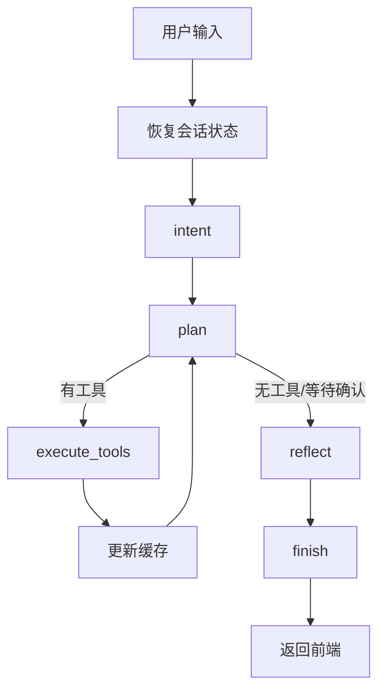
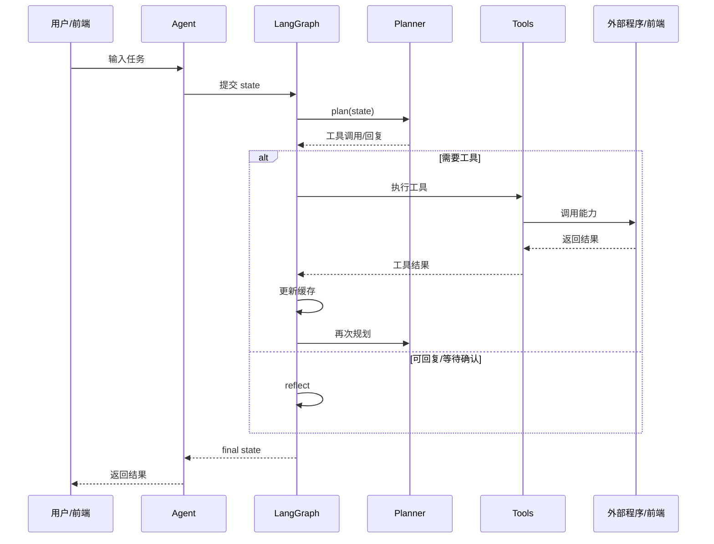
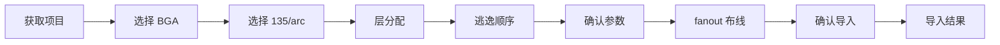
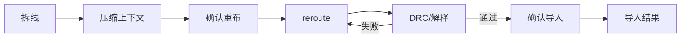

# PCB Agent LangGraph 顺序图与流程图

这份文档只放汇报交接用图，保持简洁。

## 1. 总体流程图

```mermaid
flowchart TD
    A[用户输入] --> B[恢复会话状态]
    B --> C[intent]
    C --> D[plan]
    D -->|有工具| E[execute_tools]
    E --> F[更新缓存]
    F --> D
    D -->|无工具/等待确认| G[reflect]
    G --> H[finish]
    H --> I[返回前端]
```

## 2. 调用顺序图

```mermaid
sequenceDiagram
    participant U as 用户/前端
    participant A as Agent
    participant G as LangGraph
    participant P as Planner
    participant T as Tools
    participant X as 外部程序/前端

    U->>A: 输入任务
    A->>G: 提交 state
    G->>P: plan(state)
    P-->>G: 工具调用/回复
    alt 需要工具
        G->>T: 执行工具
        T->>X: 调用能力
        X-->>T: 返回结果
        T-->>G: 工具结果
        G->>G: 更新缓存
        G->>P: 再次规划
    else 可回复/等待确认
        G->>G: reflect
    end
    G-->>A: final state
    A-->>U: 返回结果
```

## 3. Fanout 简图

```mermaid
flowchart LR
    A[获取项目] --> B[选择 BGA]
    B --> C[选择 135/arc]
    C --> D[层分配]
    D --> E[逃逸顺序]
    E --> F[确认参数]
    F --> G[fanout 布线]
    G --> H[确认导入]
    H --> I[导入结果]
```

## 4. Reroute 简图

```mermaid
flowchart LR
    A[拆线] --> B[压缩上下文]
    B --> C[确认重布]
    C --> D[reroute]
    D --> E[DRC/解释]
    E -->|失败| D
    E -->|通过| F[确认导入]
    F --> G[导入结果]
```
