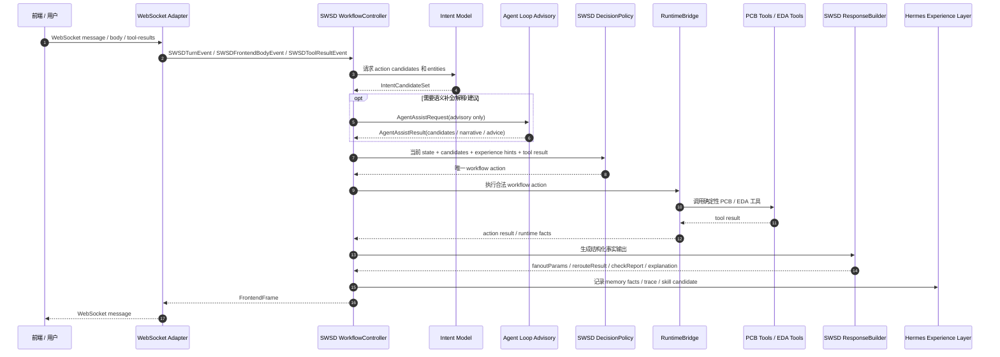
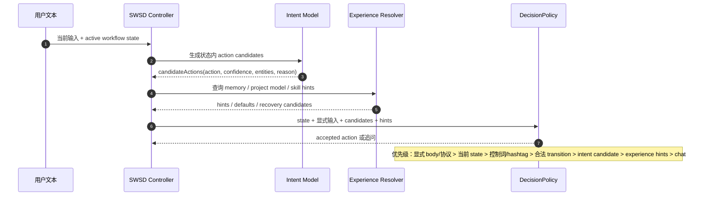
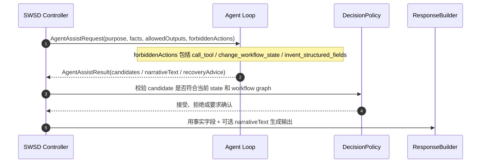
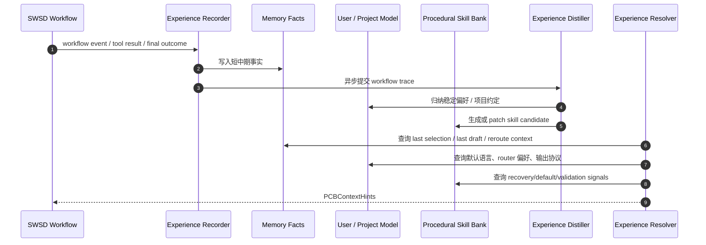
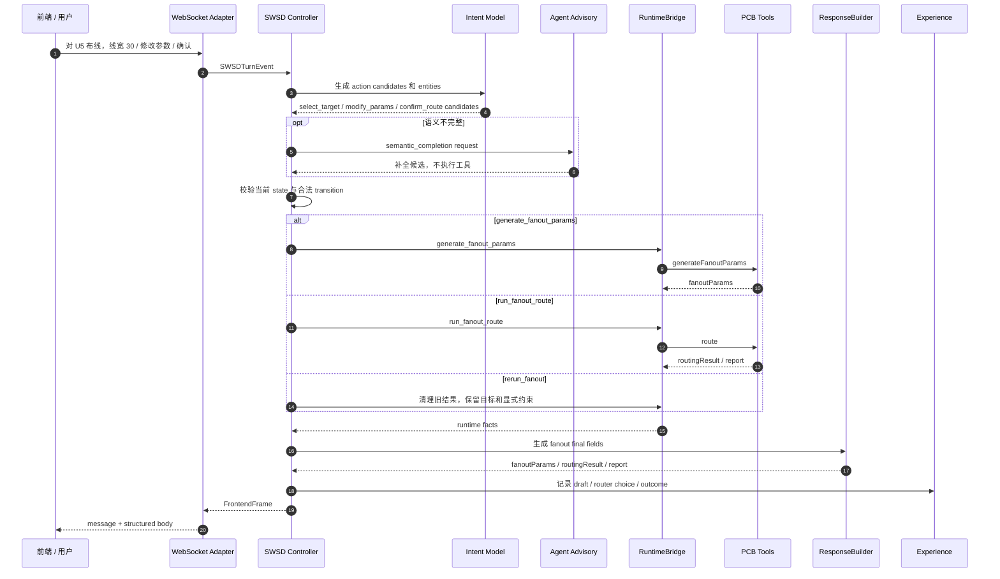
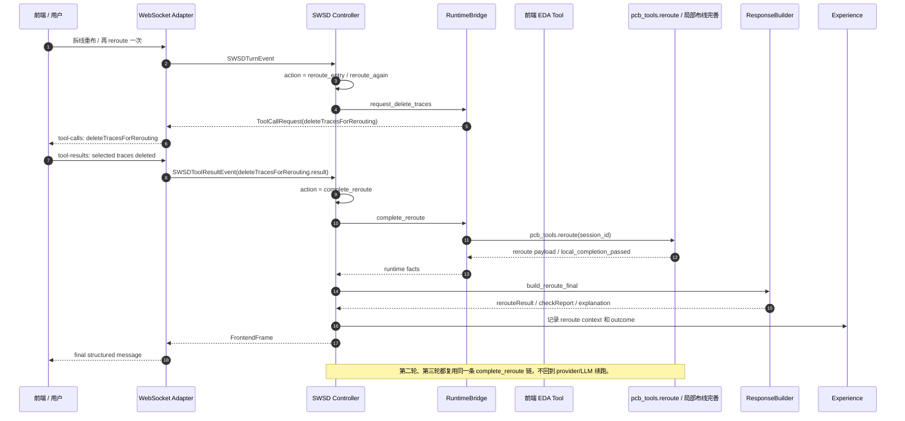
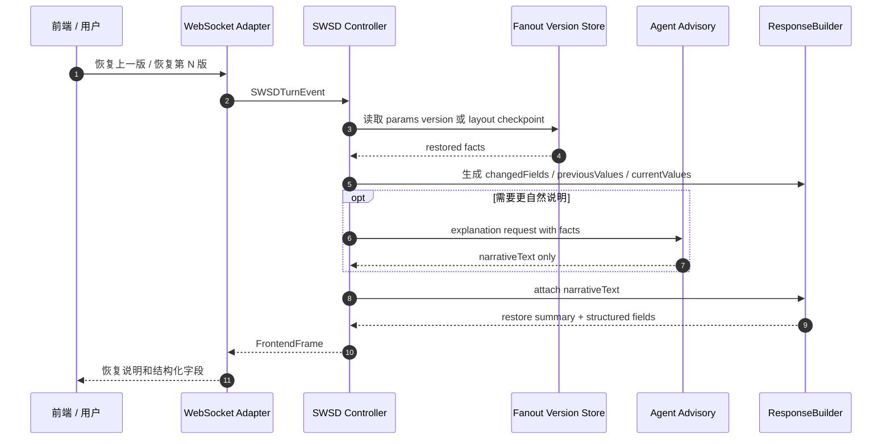

# PCB Agent 顺序图（SWSD 主控 + Agent 智能辅助版）

编写者：港科广-梁锦彬

## 核心职责边界

```text
WebSocket Adapter = 协议适配层
Intent Model = 动作候选与实体候选生成层
Agent Loop = 理解、补全、解释、建议、总结的 advisory 层
SWSD WorkflowController = 唯一流程主控与动作仲裁层
SWSD RuntimeBridge = 唯一工具 side-effect 执行层
SWSD ResponseBuilder = 唯一事实输出层
Hermes Experience Layer = memory / user-project model / skills 持续成长层
```

关键约束：

```text
Intent Model / Agent Loop 可以建议，但不能直接推进状态。
Intent Model / Agent Loop 可以解释，但不能发明最终事实字段。
Intent Model / Agent Loop 可以总结经验，但不能直接改 workflow 硬约束。
RuntimeBridge 才能执行 PCB 工具。
ResponseBuilder 才能生成前端结构化 final body。
```

## 1. 总体架构顺序图



## 2. Intent Candidate 仲裁图



## 3. Agent Advisory Mode 图



Agent Loop 允许：

```text
语义补全：理解“之前那个更稳的方式”
参数候选：线宽、线距、router/module、orderLines
异常建议：arc 失败后建议 135+RL
叙事解释：restore/reroute/fanout 结果说明
经验总结：从 trace 提炼 memory/skill/pitfall
```

Agent Loop 禁止：

```text
直接推进 SWSD state
直接调用 PCB 工具
直接执行 deleteTracesForRerouting -> reroute
直接生成 routingResult/rerouteResult/checkReport/fanoutParams 作为事实
覆盖用户显式输入
```

## 4. Hermes Grow-With-You 闭环图



使用边界：

```text
Memory Facts 只提供恢复线索，不直接执行。
User / Project Model 只提供低优先级默认，不覆盖用户显式输入。
Procedural Skills 提供流程建议、pitfall、recovery rule，但必须经 SWSD action 生效。
Experience Distiller 异步执行，不阻塞用户响应。
```

## 5. Fanout 主链图



关键语义：

```text
“重新生成参数/重新布线”在 fanout 活跃态默认是 rerun_fanout。
“拆线重布/reroute/删除框选走线重布”才切 reroute。
“回到上一步，用 135+RL”先 rollback，再用显式 router choice 覆盖历史参数。
纯数字 1/2/3/4 不触发 router 选择。
```

## 6. Reroute 多轮续跑图



## 7. Restore 解释图



## 当前验证重点

```text
1. WebSocket 不再作为业务流程主控。
2. Intent Model 输出 action candidates，不直接写状态。
3. Agent Loop 只在 advisory/chat 边界内工作。
4. SWSD DecisionPolicy 是唯一动作仲裁点。
5. RuntimeBridge 是唯一 PCB 工具 side-effect 执行点。
6. ResponseBuilder 是唯一结构化 final body 生成点。
7. Experience Layer 只提供 hints/defaults/skills，不越权执行。
8. 第二轮 reroute 不再回到 LLM/provider 续跑，因此不应再出现 401 打断流程。
```

## 一句话理解这版

```text
SWSD 开车，RuntimeBridge 执行，ResponseBuilder 报告事实；Intent Model 和 Agent Loop 坐副驾驶，负责理解、补全、解释、建议和总结；Hermes Experience 负责让系统越用越懂项目和用户。
```
