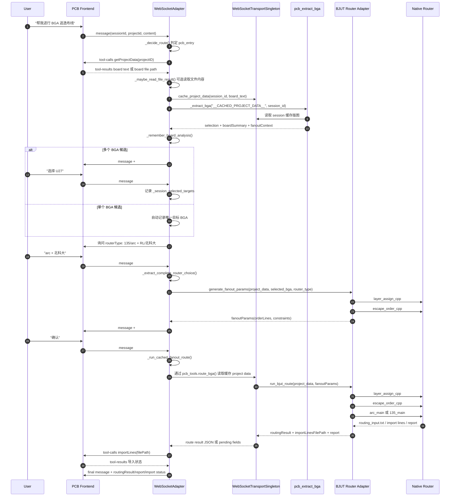
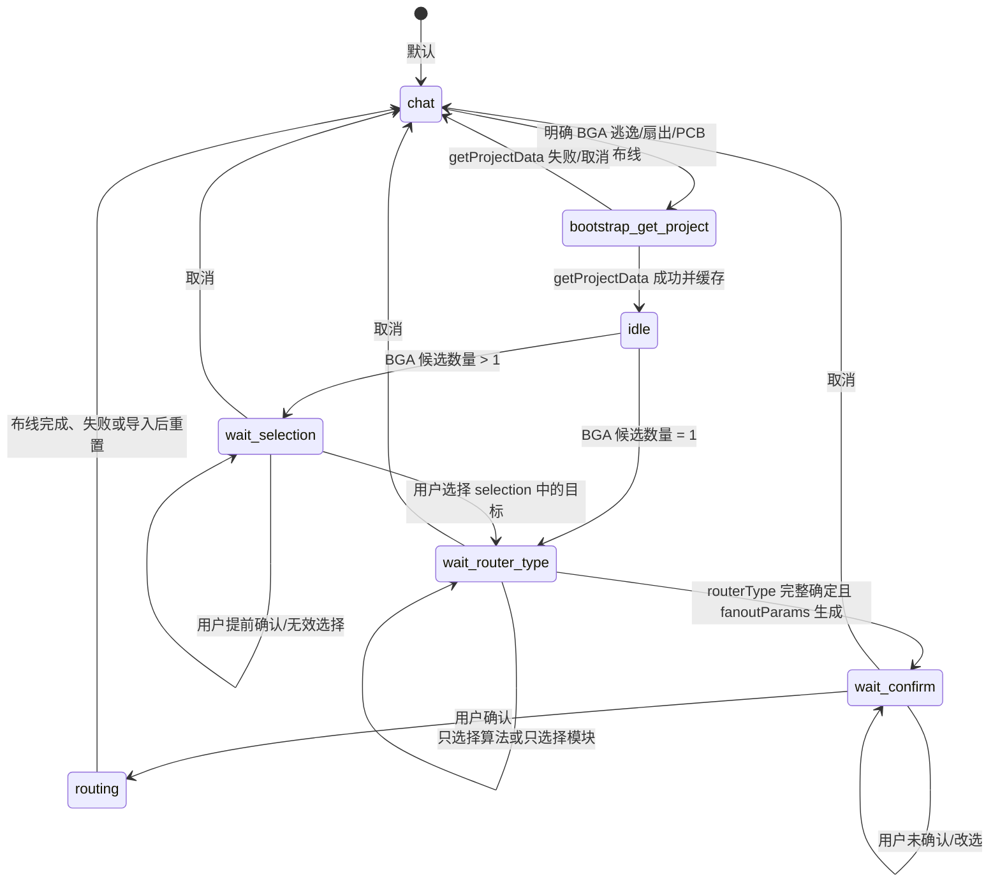
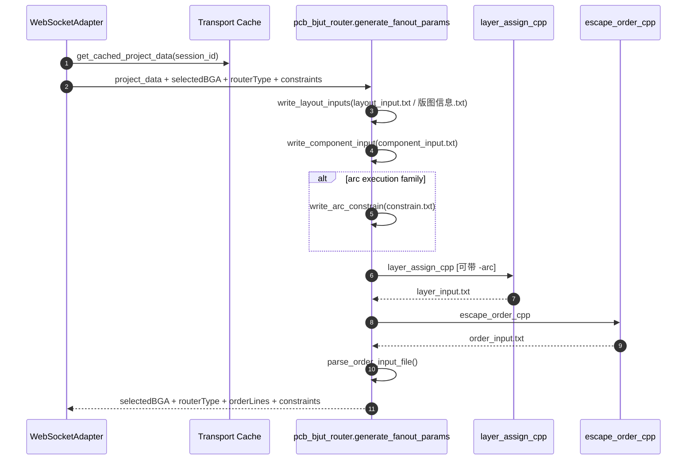
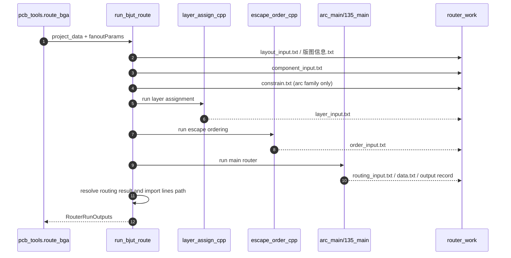

# BGA 逃逸流程现状说明

本文基于当前代码审视 BGA 逃逸布线主流程，覆盖入口判定、版图获取、BGA 分析、目标选择、算法/模块选择、fanout 参数生成、布线执行、结果导入和失败降级路径。

## 代码入口总览

| 环节 | 主要文件 | 关键函数/配置 | 职责 |
| --- | --- | --- | --- |
| WebSocket 协议与流程编排 | `gateway/platforms/websocket.py` | `_handle_user_message`、`_decide_route`、`_run_direct_bga_analysis`、`_run_direct_fanout_param_step`、`_run_cached_fanout_route` | 识别 PCB/BGA 操作意图，维护会话状态，向前端发工具调用，提取结构化字段 |
| PCB tool transport | `tools/pcb_tools.py` | `WebSocketTransportSingleton`、`get_project_data`、`route_bga` | 缓存 project data，限制工具只在 PCB 模式可用，执行 route 工具 |
| BGA/板级分析 | `tools/pcb_chunking_tool.py` | `_extract_bga`、`_analyze_board_with_model`、`_extract_rule_bga_selection` | 从缓存版图生成 `selection`、`boardSummary`、`fanoutContext` |
| BJUT/RL router adapter | `tools/pcb_bjut_router.py` | `generate_fanout_params`、`run_bjut_route`、`resolve_router_dir` | 调用 `layer_assign_cpp`、`escape_order_cpp`、`135_main`/`arc_main` |
| Skill 提示词约束 | `skills/hardware/pcb-intelligence/SKILL.md` | BGA fanout skill | 约束 LLM 在 PCB 流程中如何使用 `getProjectData`、`pcb_extract_bga`、`route` |
| 配置 | `config.ini` | `[pcb] use_long_context_module`、`[router] work_dir/arc_dir/135_dir/rl_*`、`board_data_use_file_path` | 控制长上下文分析、router 目录、版图文件路径模式 |

## 主时序图



## 会话状态机



当前状态保存在 `WebSocketAdapter` 的 per-session 字典里：

| 状态数据 | 作用 |
| --- | --- |
| `_session_flow_states` | 当前流程阶段，例如 `wait_selection`、`wait_router_type`、`wait_confirm`、`routing` |
| `_session_selection_labels` / `_session_bga_selection` | BGA 候选列表和合法选择范围 |
| `_session_selected_targets` | 用户选定的 BGA 位号 |
| `_session_route_algorithms` | 已选择的走线算法：`arc` 或 `135` |
| `_session_fanout_modules` | 已选择的层分配/逃逸顺序模块：`RL` 或 `北科大` |
| `_session_router_types` | 内部 routerType：`arc`、`135`、`rl`、`rl_arc`、`rl_135` |
| `_session_board_summaries` | `pcb_extract_bga` 产出的板级摘要 |
| `_session_fanout_contexts` | 推荐逃逸层、线宽、间距、优先级等上下文 |
| `_session_fanout_params` | 待用户确认和后续执行的 fanout 参数 |

## 详细步骤

### 1. 意图判定与流程入口

前端用户消息进入 `WebSocketAdapter._handle_user_message` 后，先调用 `_decide_route`。判定逻辑同时考虑：

- 规则关键词：`BGA`、`逃逸`、`扇出`、`PCB 布线`、`fanout` 等操作性短命令。
- LLM 意图分类结果：如果启用 route intent LLM，会先走 `_classify_route_intent_with_llm`，再由 `_validate_route_intent` 做规则兜底。
- 当前会话状态：如果已经处于 PCB 流程中，后续的“选择 U27”“arc + 北科大”“确认”等短回复会被解释为 PCB follow-up。
- 否定/概念咨询：例如“BGA 和 QFP 有什么区别？”、“不要布线，只解释原理”会回到普通聊天。
- 局部拆线重布：如果是“拆线后重布”“框选走线 reroute”等请求，会转到 `hardware/pcb-reroute`，不会进入全局 BGA fanout 主链路。

判定为 BGA 逃逸后，adapter 会设置 PCB session mode，并优先通过前端工具 `getProjectData` 启动 bootstrap。

### 2. getProjectData 与版图缓存

`_bootstrap_get_project_data` 向前端发送：

```json
{
  "type": "tool-calls",
  "body": {
    "content": {
      "name": "getProjectData",
      "arguments": {"projectID": "..."}
    }
  }
}
```

前端返回的 `tool-results` 有两种模式：

- 直接返回 S 表达式版图文本。
- 当 `BOARD_DATA_USE_FILE_PATH=1` 或配置启用文件路径模式时，返回本地文件路径；`_maybe_read_file_result` 会读取文件内容，再把文本交给上层流程。

成功后，`_cache_project_data_for_tools` 将完整 board text 存入 `WebSocketTransportSingleton._cached_project_data[session_id]`。后续 `pcb_extract_bga` 和 `route_bga` 都通过 session 缓存读取版图，避免把超大版图塞回 LLM 上下文。

### 3. BGA 分析与受控上下文

adapter 的直接路径是 `_run_direct_bga_analysis`，它调用 `tools.pcb_chunking_tool._extract_bga("__CACHED_PROJECT_DATA__", session_id=...)`，期望得到 JSON 对象：

```json
{
  "selection": [{"label": "U27", "detail": "BGA-256, 1.0mm pitch"}],
  "boardSummary": {
    "stackupSummary": ["SIG03: signal", "SIG04: signal"],
    "packageHints": ["BGA-256 x1"],
    "netSummary": {
      "groundNets": ["GND"],
      "powerNets": ["VCC"],
      "clockNets": ["CLK"],
      "signalNetCount": 128,
      "ncNetCount": 0
    }
  },
  "fanoutContext": {
    "recommendedEscapeLayers": ["SIG03", "SIG04"],
    "recommendedLineWidth": 4,
    "recommendedLineSpacing": 3,
    "prioritySuggestion": ["ground", "power", "clock", "signal"],
    "rationale": "..."
  }
}
```

`pcb_chunking_tool` 的分析路径分为三层：

1. 规则初筛：`_extract_rule_bga_selection` 调用 vendor `pcb_chunk_service.extract_bga_from_txt`，失败时走 `_extract_text_bga_selection`。
2. pin 数兜底：文本和结构化摘要路径都使用 `_BGA_MIN_PIN_COUNT = 200`，pin 数大于 200 的器件会进入 BGA 候选。
3. 长上下文模型分析：如果 `pcb_chunk_service`、chunker、converter、OpenAI-compatible adapter 等依赖可用，会构建板级 chunks，让模型输出 `selection`、`boardSummary`、`fanoutContext`；失败时回退到规则摘要。

adapter 拿到字段后调用 `_remember_board_analysis`，把 selection、summary、fanout context 缓存在 session 中。

### 4. BGA 目标选择

如果 `selection` 为空，流程重置为 chat，向前端返回“未识别到可执行 BGA 逃逸布线的 BGA 器件”，同时带上可用的 `boardSummary/fanoutContext` 字段。

如果 `selection` 只有一个元素，adapter 直接把该 label 写入 `_session_selected_targets`，进入 `wait_router_type`。

如果有多个候选，adapter 返回：

```json
{
  "selection": [
    {"label": "U27", "detail": "BGA-256, 1.0mm pitch"},
    {"label": "U35", "detail": "BGA-484, 0.8mm pitch"}
  ]
}
```

用户必须回复 selection 中的合法 label。测试覆盖了非 `U\d+` 位号，例如 `FPGA1`，说明选择逻辑不再只接受 U 系列 refdes。

### 5. 算法与模块选择

当前交互要求用户同时明确两类选择：

- 走线算法：`135` 或 `arc`
- 层分配/逃逸顺序生成模块：`RL` 或 `北科大`

组合后得到内部 `routerType`：

| 用户选择 | routerType | 执行族 |
| --- | --- | --- |
| `arc + 北科大` | `arc` | arc |
| `135 + 北科大` | `135` | 135 |
| `arc + RL` | `rl_arc` | arc |
| `135 + RL` | `rl` 或 `rl_135` | 135 |

如果用户只回复 `arc` 或只回复 `RL`，`_extract_complete_router_choice` 会先记录半选择，然后 `_router_choice_followup_prompt` 继续追问缺失项。若用户在此阶段回复“确认”，流程 fail-closed，返回“执行布线前必须先选择走线算法和层分配/逃逸顺序生成模块”。

### 6. fanoutParams 生成

进入 `_run_direct_fanout_param_step` 后，adapter 优先使用 BJUT adapter 生成参数：



如果 BJUT 可执行文件不可用或运行失败，adapter 还有两层兜底：

1. 如果 `_fanout_param_llm_enabled` 为 true，调用辅助 LLM 根据 `boardSummary/fanoutContext` 生成候选 JSON。
2. 无论候选来自 BJUT 还是 LLM，都会经过 `_validate_or_build_fanout_params`，强制修正 `selectedBGA`、`routerType`，过滤模型编造的 net，并在必要时用 `_build_deterministic_fanout_params` 生成保守默认值。

最终缓存到 `_session_fanout_params[session_id]`，进入 `wait_confirm`，并向前端输出：

```json
{
  "fanoutParams": {
    "selectedBGA": "U27",
    "routerType": "arc",
    "orderLines": [
      {"net": "GND", "layer": "SIG03", "order": 1}
    ],
    "constraints": {"LineWidth": 4, "LineSpacing": 3}
  }
}
```

可见正文当前被规范化为“已完成逃逸参数配置，请确认”，避免流式输出中重复大段 JSON。

### 7. 用户确认与布线执行

用户确认后，`_run_cached_fanout_route` 读取缓存的 `fanoutParams`，补齐 routerType 和 selectedBGA，然后调用 `pcb_tools.route_bga(json.dumps(route_params), session_id=...)`。

`route_bga` 的职责：

1. 验证当前 session 是 PCB mode。
2. 从 `WebSocketTransportSingleton` 读取缓存 project data。
3. 解析 `userData` 或嵌套的 `fanoutParams`。
4. 校验 `routerType` 属于 `arc`、`135`、`rl`、`rl_arc`、`rl_135`。
5. 根据 selectedBGA 清理旧 router 中间文件。
6. 写入本次版图输入和 `order_input.txt`。
7. 优先调用 `tools.pcb_bjut_router.run_bjut_route`。
8. 若 BJUT 不可用且 routerType 是 `arc`/`135`，回退到旧 `_run_arc_router` / `_run_135_router`。
9. 将 `routingResult`、`importLinesFilePath`、`report` 写入 pending PCB fields，返回短报告。

`run_bjut_route` 内部会再次运行完整三段 router pipeline：



这里有一个看起来重复、但有意为之的点：fanoutParams 生成阶段已经运行过 `layer_assign_cpp` 和 `escape_order_cpp`，真正 route 阶段仍会重新跑一遍。原因是 route 阶段必须基于本次确认的 fanoutParams、约束和最新清理后的工作目录生成正式布线输出，不能信任上一次中间文件仍然有效。

### 8. 结果导入与前端结构化字段

`_run_cached_fanout_route` 将 `route_bga` 的返回解析成字段：

- `routingResult`：通常指向 `routing_input.txt`
- `importLinesFilePath`：真正用于前端 `importLines` 的 router 原始记录文件
- `report`：布线报告
- `successPins` / `failedPins`：如 router 返回则透传

随后 `_import_fanout_result` 选择导入文件：

- 优先用 `importLinesFilePath`。
- 如果只有 `routingResult` 且文件名是 `routing_input.txt`，会跳过 `importLines`，因为它不是前端导入记录格式。
- 调用前端工具 `importLines(filePath, successPins, failedPins)`，并把导入成功/失败状态追加到最终回复。

最终消息会把字段放进 `##PCB_FIELDS##`，WebSocket adapter 再通过 `_extract_pcb_fields` / `_collect_pcb_fields` 提取到消息 body，使前端可以直接读取 `selection`、`fanoutParams`、`routingResult`、`report` 等字段。

## 失败与降级路径

| 场景 | 当前行为 |
| --- | --- |
| 用户只是概念咨询或明确不要操作 | `_decide_route` 回到 chat，不调用 PCB 工具 |
| getProjectData 失败/超时 | 返回“获取 PCB 版图数据失败”，重置流程到 chat |
| getProjectData 文件路径模式返回的路径不存在 | 保留原始 result，后续可能因非有效版图失败 |
| `pcb_extract_bga` 抛异常 | 返回“PCB 版图分析失败”，重置流程 |
| 未识别到 BGA | 返回说明和已知字段，重置流程 |
| 多 BGA 阶段用户提前确认 | fail-closed，提示先选择目标器件 |
| routerType 阶段用户提前确认 | fail-closed，提示先选择算法和模块 |
| BJUT fanoutParams 生成失败 | 可选 LLM 兜底；否则确定性 fallback |
| LLM 生成了错误 selectedBGA/routerType/net | `_validate_or_build_fanout_params` 纠正或过滤 |
| route 缺少 project data | `route_bga` 返回“缺少版图数据，请先调用 getProjectData” |
| route 缺少 routerType/orderLines | 返回结构化错误报告，不执行布线 |
| router 目录缺少可执行文件 | 对 `arc`/`135` 可回退旧 adapter；RL 类直接提示配置问题 |
| router 执行超时 | 返回“布线器执行超时（> 5 分钟）” |
| importLines 失败 | 保留 routing result，并在最终文本说明导入失败原因 |

## 关键协议字段

### selection

给前端展示 BGA 候选列表，元素至少包含：

```json
{"label": "U27", "detail": "BGA-256, 1.0mm pitch"}
```

### fanoutParams

用于确认和执行布线：

```json
{
  "selectedBGA": "U27",
  "routerType": "arc",
  "orderLines": [
    {"net": "GND", "layer": "SIG03", "order": 1}
  ],
  "constraints": {
    "LineWidth": 4,
    "LineSpacing": 3
  }
}
```

注意：skill 文档里仍写“routerType 只允许 arc 或 135”，但当前代码和工具 schema 已经支持 `rl`、`rl_arc`、`rl_135`。这是文档和实现之间的小偏差。

### routingResult / importLinesFilePath

- `routingResult` 指向布线结果大文件，常见为 `router_work/routing_input.txt`。
- `importLinesFilePath` 指向前端可导入的原始布线记录，例如 `ARC_output.txt`。
- adapter 会优先用 `importLinesFilePath` 调用前端 `importLines`。

## 现有测试锚点

当前 `tests/gateway/test_websocket_pcb_flow.py` 覆盖了主链路和关键防线：

- selection -> fanoutParams -> routingResult 的 WebSocket 往返。
- BGA flow 不进入主 agent handler 的直接 adapter 路径。
- 选择阶段提前“确认”会 fail-closed。
- 非 `U\d+` 位号如 `FPGA1` 可被选择。
- fanoutParams 可见正文会被归一化。
- LLM/模型候选 fanoutParams 会被验证，不允许直接伪造 routingResult。
- 明确 BGA 操作请求不会被错误 LLM chat intent 吞掉。
- “BGA 和 QFP 有什么区别”这类咨询保持 chat。
- 文件路径模式下 getProjectData 返回 board 文件路径时可被读取。
- `importLines` 会收到 `importLinesFilePath` 和 success/failed pins。

## 维护注意点

1. BGA 主链路现在更像 adapter-controlled workflow，而不是完全交给 LLM tool calling。修改流程时优先看 `gateway/platforms/websocket.py` 的状态机。
2. 不要把大版图文本注入 LLM 上下文；主链路依赖 session 缓存和 `__CACHED_PROJECT_DATA__`。
3. `route` 工具是本地 adapter 调用，不应该作为前端 `tool-calls` 发给 PCB 客户端；前端只接收 `getProjectData` 和 `importLines`。
4. 用户确认前必须已经有完整 `fanoutParams.routerType`，且 `routerType` 不能是旧的 `pcb_fanout`。
5. 修改 `routerType` 枚举时，需要同时更新 `websocket.py`、`pcb_bjut_router.py`、`pcb_tools.py`、skill 文档和测试。
6. `generate_fanout_params` 和 `run_bjut_route` 都会运行 layer/order 工具；如果以后要复用中间文件，需要额外设计缓存一致性和清理策略。
7. 当前工作目录、router 目录和相对路径解析都依赖 `config.ini` 与环境变量；跨机器部署时优先检查 `[router]` 配置。

