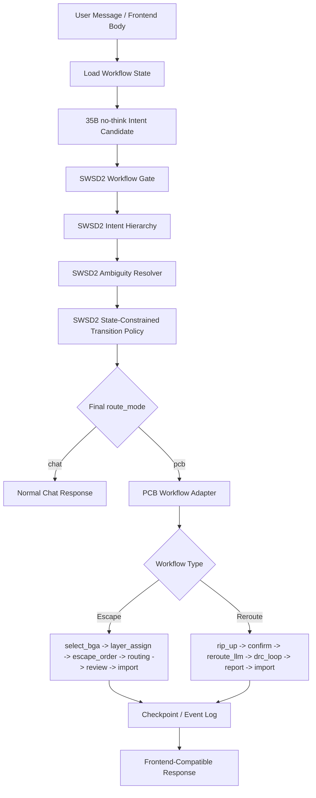
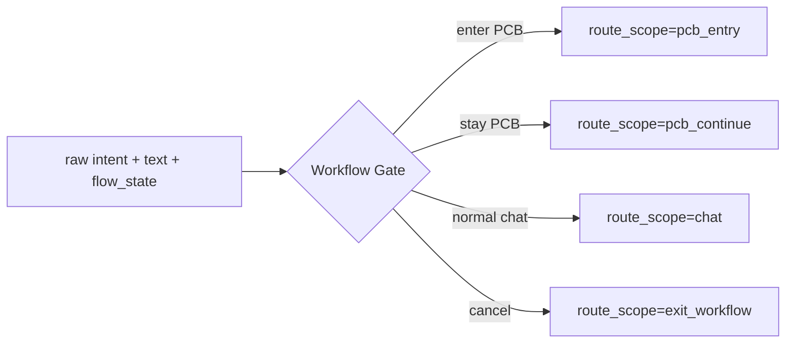
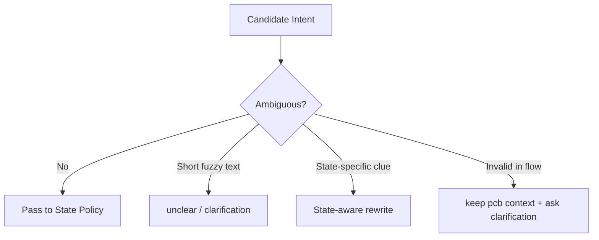
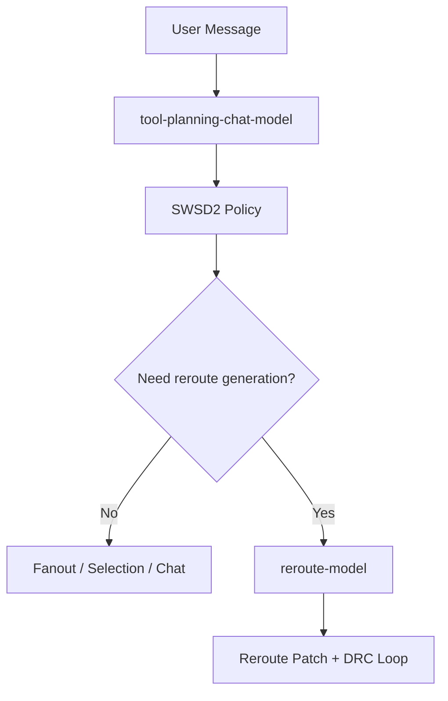
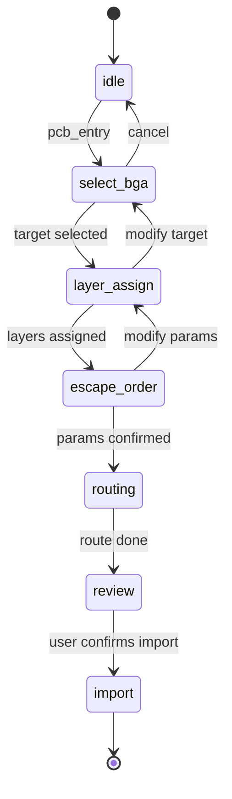
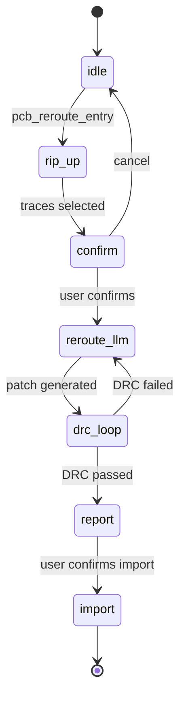

# 35B no-think + SWSD2 方案介绍文档

生成时间：2026-06-14  
用途：用于绘制 SWSD2 intent/workflow 架构图  
方案名称：`35B no-think + SWSD2 State-Constrained Workflow Policy`

## 一、方案定位

| 项目 | 内容 |
|---|---|
| 目标 | 在 PCB Agent 中稳定识别用户意图，并根据当前 workflow state 做可解释的状态转移 |
| 核心问题 | 单纯 LLM intent 分类容易被 Thinking Process、模糊表达、流程上下文缺失和脏数据影响 |
| 解决思路 | 用 35B no-think 产生结构化候选，再由 SWSD2 做 workflow gate、层级意图解析、歧义处理和状态约束校准 |
| 最终能力 | 既保留 LLM 的语义理解，又用确定性 workflow policy 保证 PCB 流程不乱跳、不误触发工具 |

## 二、总体架构图节点

| 层级 | 模块 | 作用 | 输入 | 输出 |
|---|---|---|---|---|
| 输入层 | User Message | 用户自然语言、前端 body、workflow 上下文 | text, body, session_id | 标准化请求 |
| 上下文层 | Workflow State Store | 读取当前 PCB workflow 状态 | session_id | flow_state, payload, history |
| 模型层 | 35B no-think Intent Candidate | 使用 `[tool-planning-chat-model]` 做结构化候选分类 | text, flow_state, lean prompt | raw intent JSON |
| 结构层 | SWSD2 Workflow Gate | 判断是否进入或保持 PCB workflow | raw intent, text, flow_state | route_scope |
| 结构层 | SWSD2 Intent Hierarchy | 拆分 task/control/meta/invalid 意图 | raw intent, text | hierarchical intent |
| 结构层 | SWSD2 Ambiguity Resolver | 处理短句、含糊句、流程内无效输入 | hierarchical intent, confidence, state | clarified intent |
| 结构层 | SWSD2 State-Constrained Policy | 按当前状态限制合法转移 | clarified intent, flow_state | final intent, route_mode |
| 执行层 | PCB Workflow Adapter | 调用 selection/fanout/reroute/import 等路径 | final intent, payload | tool/action plan |
| 持久层 | Checkpoint/Event Log | 记录状态、事件、可恢复 checkpoint | transition, tool result | workflow_sessions/events/checkpoints |
| 输出层 | Frontend-Compatible Response | 保持原前端字段兼容 | action result, state | selection/fanoutParams/routingResult 等 |

## 三、一张图版本

## 四、35B no-think 在方案中的位置

35B 不直接决定最终动作，只提供一个结构化候选。最终是否进入 PCB、是否继续当前流程、是否调用工具，由 SWSD2 决策层校准。

| 项目 | 设计 |
|---|---|
| 模型来源 | `[tool-planning-chat-model]` |
| 推荐模型 | `qwen3.6-35b-a3b` no-think endpoint |
| 关键请求参数 | 顶层 `enable_thinking=false` |
| 输出约束 | `response_format={"type":"json_object"}` |
| token 策略 | 首轮 `max_tokens=256`，必要时小范围 retry |
| 禁止事项 | 不使用 `[reroute-model]` 做 intent 分类 |
| 工程意义 | 避免 Thinking Process 污染 parser，使 raw intent 稳定 JSON 化 |

## 五、SWSD2 核心模块

### 5.1 Workflow Gate

Workflow Gate 是第一道门，用于判断当前请求属于普通聊天、PCB 入口、还是已有 PCB workflow 的后续输入。

| 输入条件 | 决策 |
|---|---|
| idle 状态 + 明确 PCB fanout/escape/reroute 请求 | 进入 PCB workflow |
| idle 状态 + 普通知识咨询 | 保持 chat |
| PCB 流程内 + 简短确认/修改/选择 | 保持 PCB workflow |
| PCB 流程内 + 明确取消 | 退出 PCB，回到 chat |
| PCB 流程内 + 无效或含糊输入 | 不丢上下文，进入 clarification |

图中可画成：

### 5.2 Intent Hierarchy

SWSD2 不只看一个扁平 `intent`，而是把用户意图拆成四类，便于处理“既说任务又说不要执行”的复合表达。

| 层级意图 | 例子 | 作用 |
|---|---|---|
| task_intent | 做 fanout、重新布线、选择 U23 | 表示用户想完成什么工程任务 |
| control_intent | 确认、取消、返回上一步、修改参数 | 表示用户如何控制当前流程 |
| meta_intent | 解释一下、不要调用工具、只说明 | 表示用户对执行方式的约束 |
| invalid_intent | 胡言乱语、无关输入、流程内非法输入 | 表示需要澄清或拒绝推进 |

典型处理：

| 用户表达 | 层级解释 | 最终处理 |
|---|---|---|
| “只做 fanout，不要 reroute” | task_intent=fanout, meta/control=avoid_reroute | 进入 escape/fanout，不进入 reroute |
| “先别执行，解释一下方案” | task_intent=pcb_escape, meta_intent=explain_only | route_mode 可保持 chat 或 pcb explanation，不触发工具 |
| “取消” | control_intent=cancel | route_mode=chat，退出流程 |

### 5.3 Ambiguity Resolver

Ambiguity Resolver 负责处理脏数据、短句、上下文依赖和低置信度候选。

| 场景 | 旧问题 | SWSD2 处理 |
|---|---|---|
| “嗯”“好的”“随便” | 容易被误判成确认执行 | 在 wait_confirm 中不直接执行，除非明确 go/开始/执行 |
| “帮忙？” | 容易落成 chat | 标为 unclear，必要时澄清 |
| 流程内无效输入 | 容易丢失 PCB 上下文 | route_mode 保持 pcb，进入 clarification |
| LLM 输出低置信度 | 可能误触发工具 | 降级为 unclear 或规则兜底 |
| 选择阶段输入 “U23” | LLM 可能看不懂 | 结合 flow_state 归为 pcb_select_target |

图中可画成：

### 5.4 State-Constrained Transition Policy

这是 SWSD2 最关键的结构化约束层：同一句话在不同状态下可以有不同含义，但每个状态只允许有限的合法 intent。

| 当前状态 | 合法意图 | 典型输入 | 输出 |
|---|---|---|---|
| idle | chat, pcb_entry, pcb_reroute_entry, unclear | “帮我做 BGA fanout” | pcb_entry |
| wait_selection | pcb_select_target, pcb_modify_target, cancel, unclear | “选 U23” | pcb_select_target |
| wait_router_type | pcb_followup, pcb_modify_params, cancel, unclear | “用 arc”“135 度” | pcb_followup |
| wait_confirm | pcb_confirm_route, pcb_modify_params, cancel, unclear | “开始执行”“改成 4 层” | confirm 或 modify |
| routing | cancel, status_query, unclear | “现在到哪了” | status_query |
| reroute | pcb_reroute_confirm, cancel, unclear | “继续重布线” | reroute_confirm |

状态约束的意义：

| 没有状态约束 | 有 SWSD2 状态约束 |
|---|---|
| “U23” 可能被当成 chat | wait_selection 中归为选择目标 |
| “OK” 可能误触发执行 | wait_confirm 中结合明确程度判断 |
| “arc” 可能被当成无意义词 | wait_router_type 中归为布线类型选择 |
| “取消” 仍 route_mode=pcb | 统一归一为 route_mode=chat |

## 六、双模型隔离设计

| 模型 | 负责内容 | 不负责内容 |
|---|---|---|
| `[tool-planning-chat-model]` | chat、intent 分类、SWSD2 候选、工具规划、fanout 参数辅助生成 | reroute patch 生成 |
| `[reroute-model]` | 拆线重布、DRC loop、reroute patch 生成 | intent 分类、普通 chat、SWSD transition |

图中建议把两个模型画成两条分离通道：

## 七、Checkpoint 与 Event Log

SWSD2 不只是分类器，它会把 workflow 当成可恢复的状态机管理。

| 数据 | 作用 |
|---|---|
| workflow_sessions | 保存当前 session 的 workflow_id、current_state、payload |
| workflow_events | 记录用户输入、intent candidate、policy decision、tool result |
| workflow_checkpoints | 保存关键状态，可用于回退、恢复、跳转 |

可支持的交互：

| 用户说法 | 系统行为 |
|---|---|
| “回到上一步” | 从 checkpoint rollback |
| “目标 BGA 改成 U23” | user-driven jump 到 selection/params 相关状态 |
| “换成 4 层方案” | 修改 state_payload 并重新规划 |
| “取消” | 记录 cancel event，退出当前 workflow |

## 八、前端协议兼容

SWSD2 是后端决策层，不改变前端已有字段名。

| 字段 | 保持兼容 |
|---|---|
| `selection` | 是 |
| `fanoutParams` | 是 |
| `routingResult` | 是 |
| `rerouteResult` | 是 |
| `checkReport` | 是 |
| `explanation` | 是 |

图中建议把 SWSD2 画在 WebSocket adapter 内部，前端看到的仍然是原协议字段。

## 九、端到端流程

### 9.1 Escape / Fanout Flow

### 9.2 Reroute Flow

## 十、为什么该方案有效

| 问题类型 | 35B no-think 解决 | SWSD2 解决 |
|---|---|---|
| Thinking Process 污染输出 | 是，通过顶层 no-thinking 和 JSON response_format | 间接减少解析失败传播 |
| LLM 分类边界不稳定 | 部分解决 | 是，用状态约束和规则校准 |
| 流程内短句依赖上下文 | 否 | 是，例如 “U23”“arc”“开始” |
| 取消/返回/修改等控制意图 | 部分解决 | 是，control_intent 独立建模 |
| 脏数据/胡言乱语 | 部分解决 | 是，invalid/unclear 分流 |
| 前端协议兼容 | 无关 | 是，后端增强但不改字段名 |

## 十一、实验指标

| 方案 | Raw 准确率 | SWSD2 后准确率 | 提升 |
|---|---:|---:|---:|
| 72B | 75.00% | 88.60% | +13.60 |
| 35B 旧调用 | 34.11% | 84.20% | +50.09 |
| 35B no-think | 74.80% | 86.60% | +11.80 |

结论：35B no-think 让 raw LLM 恢复到可用水平，SWSD2 再通过结构化 workflow policy 把结果推到 86.60%。因此最终推荐图中突出两个关键点：

1. 35B 是候选生成器，不是最终决策器。
2. SWSD2 是 workflow-aware 的状态约束决策层，负责把候选意图变成安全、可恢复、可解释的工程动作。

## 十二、适合画图的简化口径

可以把整套方案压缩成一句图注：

> 35B no-think provides structured intent candidates; SWSD2 turns them into state-constrained, checkpointed PCB workflow transitions.

中文图注：

> 35B no-think 负责稳定产出结构化意图候选，SWSD2 负责结合 workflow state 做可解释、可回退、前端兼容的状态约束决策。

