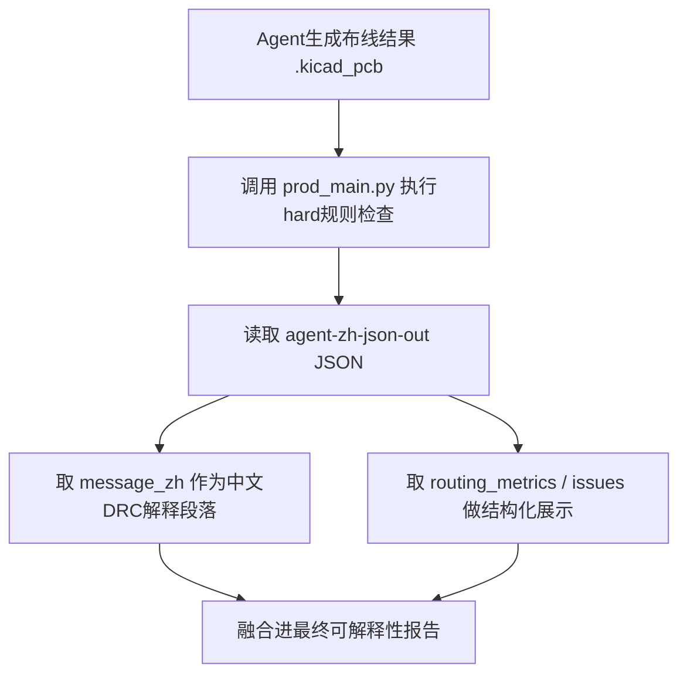

# PCB DRC规则检查工具 Agent接入说明

## 1. 接入目标

本工具用于在智能体完成BGA逃逸布线后，对输出的 `.kicad_pcb` 文件执行规则检查。

当前默认只执行 `hard` 规则，不启用差分检查，也不调用LLM。工具负责：

- 输入：布线后的 KiCad PCB 文件。
- 输出：规则检查结果 JSON。
- 提供一段可直接融合进可解释性报告的中文 `message_zh`。

推荐 agent 在“生成布线结果”之后立即调用本工具，将 `message_zh` 合并进最终可解释性报告。

## 2. 推荐调用方式


```bash
python prod_main.py samples/prediction.kicad_pcb --target-bga U1 --agent-zh-json-out out/drc_agent_zh.json
```

默认检查模式为 `hard`。一般 agent 不需要额外传 `--check-mode`。

## 3. Agent调用流程

推荐流程如下：



## 4. 返回JSON结构

`--agent-zh-json-out` 输出的 JSON 顶层结构如下：

```json
{
  "schema_version": "drc_agent_v2",
  "language": "zh-CN",
  "tool": {},
  "input": {},
  "message_zh": "...",
  "result": {},
  "board_info": {},
  "routing_metrics": {},
  "precheck": {},
  "issues": []
}
```

### 4.1 可直接进入报告的字段

agent 最简单的融合方式是直接读取：

```json
message_zh
```

该字段是一段中文报告文本，包含：

- 目标BGA信息。
- PCB铜层/布线层数。
- 信号网络数和总网络数。
- BGA逃逸布通率。
- Hard错误总数。
- 错误类型统计。
- 每个错误的具体位置、层、网络、对象、坐标和修复建议。

### 4.2 结构化摘要字段

`result` 示例：

```json
{
  "conclusion": "Hard检查未通过",
  "check_mode": "hard",
  "target_bga": "U1",
  "target_bga_pad_count": 520,
  "layer_count": 6,
  "escape_completion_rate": 100.0,
  "escape_completion_rate_text": "100.00%",
  "hard_issue_count": 9,
  "selected_issue_count": 9,
  "rule_counts": {
    "HR_DRC_SEGMENT_CROSSING": 9
  }
}
```

### 4.3 板级信息字段

`board_info` 示例：

```json
{
  "target_bga": "U1",
  "target_bga_pad_count": 520,
  "layer_count": 6,
  "layer_names": ["ART03", "ART04", "Bottom", "GND02", "POWER05", "Top"],
  "all_layer_count": 23,
  "all_layer_names": ["Top", "GND02", "..."],
  "net_count": 199,
  "signal_net_count": 199
}
```

说明：

- `layer_count` 是铜层/布线层数量，推荐报告使用这个字段。
- `all_layer_count` 是 KiCad 文件中的完整层表数量，包含丝印、阻焊、用户层等辅助层，一般不作为“PCB布线层数”展示。

### 4.4 布通率字段

`routing_metrics` 示例：

```json
{
  "signal_pad_count": 199,
  "valid_escape_pad_count": 199,
  "failed_escape_pad_count": 0,
  "escape_completion_rate": 100.0,
  "escape_completion_rate_text": "100.00%"
}
```

注意：当前布通率表示“BGA信号焊盘是否完成逃逸连通”。它不等于最终合法率。  
例如：布通率可能是 100%，但仍存在同层异网交叉等 hard 错误。

### 4.5 错误详情字段

`issues` 中每一项表示一个规则错误，示例：

```json
{
  "rule": "HR_DRC_SEGMENT_CROSSING",
  "rule_name_zh": "同层异网线段冲突",
  "severity": "ERROR",
  "severity_zh": "错误",
  "problem_zh": "不同网络的铜线段在同一层发生交叉或重叠。",
  "impact_zh": "这是直接的电气/几何硬性违规，通常会导致布线不可用。",
  "suggestion_zh": "调整其中一条线段的路径、层或过孔位置，消除同层异网冲突。",
  "location_zh": "对象1=SEG_103，对象2=SEG_1267，网络=NET_U1_AB2|NET_U1_AA4，层=Top，坐标=(42.300001, 35.966668)",
  "location": {
    "net": "NET_U1_AB2|NET_U1_AA4",
    "layer": "Top",
    "x": 42.300001,
    "y": 35.966668,
    "obj1": "SEG_103",
    "obj2": "SEG_1267"
  }
}
```

agent 如果只生成自然语言报告，读取 `location_zh` 即可。  
如果前端或可视化工具需要定位对象，可以读取 `location` 和 `extra`。

## 5. Agent侧伪代码

Python示例：

```python
import json
import subprocess
from pathlib import Path


def run_drc_after_routing(pcb_path: str, output_json: str):
    cmd = [
        "python",
        "prod_main.py",
        pcb_path,
        "--agent-zh-json-out",
        output_json,
    ]

    completed = subprocess.run(
        cmd,
        cwd="pcb_drc_demo_v4",
        text=True,
        capture_output=True,
    )

    if completed.returncode != 0:
        raise RuntimeError(completed.stderr or completed.stdout)

    with open(output_json, "r", encoding="utf-8") as f:
        drc_result = json.load(f)

    return {
        "drc_message": drc_result["message_zh"],
        "drc_summary": drc_result["result"],
        "drc_issues": drc_result["issues"],
    }


result = run_drc_after_routing(
    pcb_path="out/routed_result.kicad_pcb",
    output_json="out/drc_agent_zh.json",
)
```

报告融合建议：

```python
final_report = f"""
## 布线结果说明
这里放agent原有的布线解释。

## DRC规则检查
{result["drc_message"]}
"""
```

## 6. 退出码和错误处理

正常运行：

- 退出码 `0`。
- 输出 JSON 中包含 `message_zh`、`result`、`issues` 等字段。

异常运行：

- 文件不存在：退出码 `1`。
- 参数错误：退出码 `2`。
- 其他异常：退出码 `1`。

如果发生异常，工具会尽量向指定输出路径写入：

```json
{
  "status": "failed",
  "error": {
    "type": "错误类型",
    "message": "错误信息"
  }
}
```

agent 侧应先判断 JSON 中是否存在 `error` 字段。

## 7. 交付方式建议

### 7.1 推荐交付源码压缩包

如果对方开发环境可以安装/运行 Python，推荐直接给源码压缩包。压缩包应包含：

- `prod_main.py`
- `main.py`
- `zh_report_builder.py`
- `agent_payload_builder.py`
- `report_builder.py`
- `engine/`
- `geometry/`
- `model/`
- `parser/`
- `rules/`
- `loader/`
- `docs/agent_integration_guide.md`

可以附带：

- `samples/` 中少量样例文件，用于对方自测。
- `drc_tool.md` 或规则说明文档。

不建议放入：

- `.git/`
- `__pycache__/`
- `build/`
- 旧的 `dist/`，除非已经重新打包并验证。
- 大型中间结果，例如 `result_900.json`。
- 临时输出目录，例如 `out/`。

### 7.2 如果要给可执行文件

项目里已有打包相关文件，但如果代码有更新，需要重新打包并验证。  
只有在重新构建后的可执行文件能够输出 `--agent-zh-json-out` 时，才建议把 `dist/` 作为交付物。

否则更稳妥的是交付源码包，让对方直接用：

```bash
python prod_main.py ...
```

## 8. 对接方最少需要知道的三件事

1. 布线完成后，把生成的 `.kicad_pcb` 路径传给 `prod_main.py`。
2. 使用 `--agent-zh-json-out` 获取中文 agent-ready JSON。
3. 报告里直接融合 `message_zh`，结构化展示读取 `result`、`routing_metrics` 和 `issues`。
